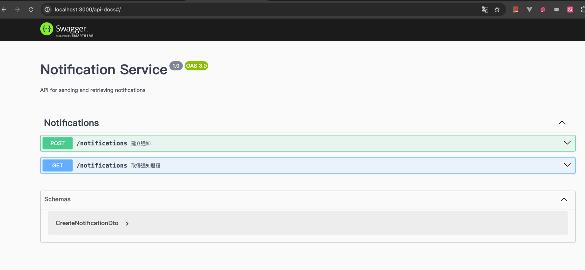
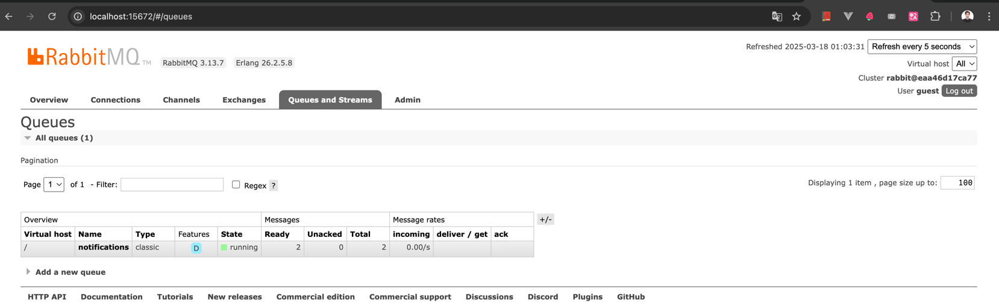
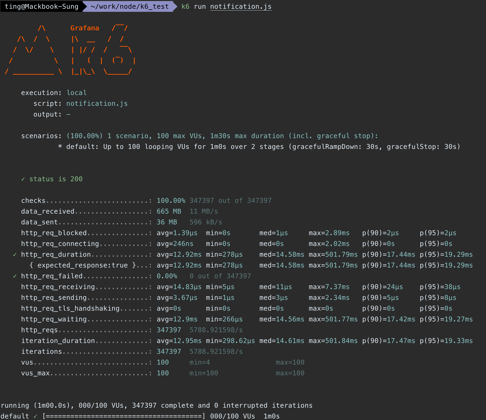
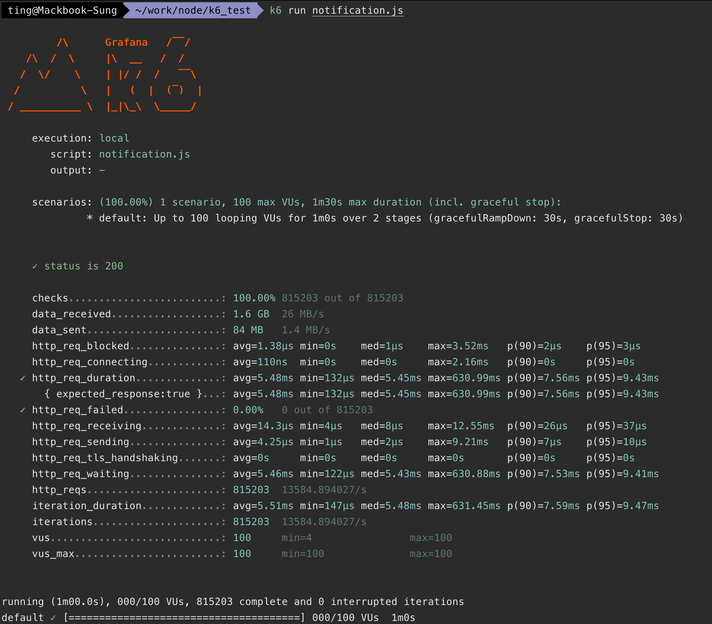

# 📢 Notification Microservice

一個使用 **NestJS + Fastify** 打造的高效能通知微服務，結合 RabbitMQ、Redis 快取與 MySQL，
具備完整 API 文件、單元測試與 Docker 部署。

---

## 🚀 功能簡介

- **通知建立** → 支援 RabbitMQ 非同步處理
- **通知歷程查詢** → 近 20 筆，支援 Redis 快取
- **支援通知類型** → Email、SMS，可擴充
- **工廠模式 + Proxy 快取模式**
- **單元測試覆蓋率 90%+**

---

## 📦 技術棧

- **NestJS + Fastify**
- TypeScript
- TypeORM + MySQL
- Redis (Cache)
- RabbitMQ (非同步佇列)
- Jest 測試
- ESLint + Prettier
- Swagger API 文件
- Docker 容器化部署

---

## 目錄結構
```pgsql
.
├── src
│   ├── app.module.ts
│   ├── cli
│   ├── config
│   ├── controllers
│   ├── dtos
│   ├── entities
│   ├── enums
│   ├── handlers
│   ├── main.ts
│   ├── migrations
│   ├── modules
│   ├── proxy
│   ├── seeds
│   ├── services
│   └── workers
├── test
├── README.md
├── eslint.config.mjs
├── jest.config.js
├── nest-cli.json
├── package-lock.json
├── package.json
├── tsconfig.build.json
└── tsconfig.json

```
---

## 🛠️ 安裝 & 啟動

```bash
# 安裝依賴
npm install

# 執行資料庫遷移
npm run migration:run

# Seeder 假資料
npm run seed:run

# 啟動服務
npm run start:dev

# 啟動 Worker 消費 RabbitMQ
npm run worker
```
---

## 🧪 測試 (Jest)
```bash
複製程式碼
npm run test
npm run test:cov
覆蓋率目標：
Statements: 90%+
Branches: 85%+
Functions: 90%+
Lines: 90%+
```

---
## 📄 API 文件 (Swagger API)

啟動後可透過 Swagger 瀏覽 API：
http://localhost:3000/api-docs


---

## 🐰 RabbitMQ IDE
http://localhost:15672/
guest/guest

http://localhost:15672/#/queues


---

## 📊 壓力測試報告(K6)

## 測試條件

| 項目 | 設定 |
|-----|-----|
| API | `/notifications?user_id=1` |
| 測試工具 | K6 |
| Duration | 1 min |
| VU | 100 |
| Redis Cache | 分別測試開啟 / 關閉 |

## 核心指標對比

| 指標 | 有快取 | 無快取 | 差異 |
|------|---------|---------|---------|
| 平均 Response Time | 5.48ms | 12.92ms | +2.4x |
| P90 Response Time | 7.56ms | 17.44ms | +2.3x |
| P95 Response Time | 9.43ms | 19.29ms | +2x |
| Throughput | 13,584 req/s | 5,789 req/s | -57% |
| Max Response | 630ms | 501ms | 偶發 spike |
| Error Rate | 0% | 0% | 穩定 |

### 無快取-測試報告


### 有快取-測試報告


## 數據分析

- Redis 快取顯著提升效能，減少 DB 負擔
- 無快取時吞吐量下降近 60%，延遲翻倍

---

## Dockerfile
```dockerfile

# Dockerfile
FROM node:18-alpine

WORKDIR /app

COPY package*.json ./

RUN npm install

COPY . .

RUN npm run build

CMD ["node", "dist/main"]


```
## 🐳 docker-compose.yml
```
version: "3.8"

services:
  app:
    build: .
    ports:
      - "3000:3000"
    environment:
      DB_HOST: mysql
      DB_PORT: 3306
      DB_USER: root
      DB_PASSWORD: root
      DB_NAME: notification_service
      REDIS_HOST: redis
      RABBITMQ_URL: amqp://rabbitmq
    depends_on:
      - mysql
      - redis
      - rabbitmq

  mysql:
    image: mysql:8
    restart: always
    environment:
      MYSQL_ROOT_PASSWORD: root
      MYSQL_DATABASE: notification_service
    ports:
      - "33060:3306"

  redis:
    image: redis:6
    ports:
      - "6379:6379"

  rabbitmq:
    image: rabbitmq:3-management
    ports:
      - "5672:5672"
      - "15672:15672"

```